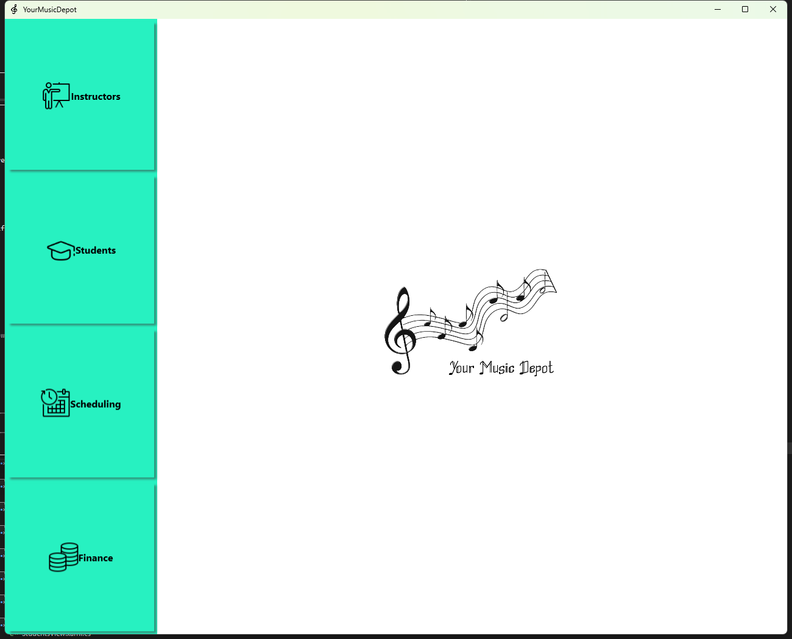
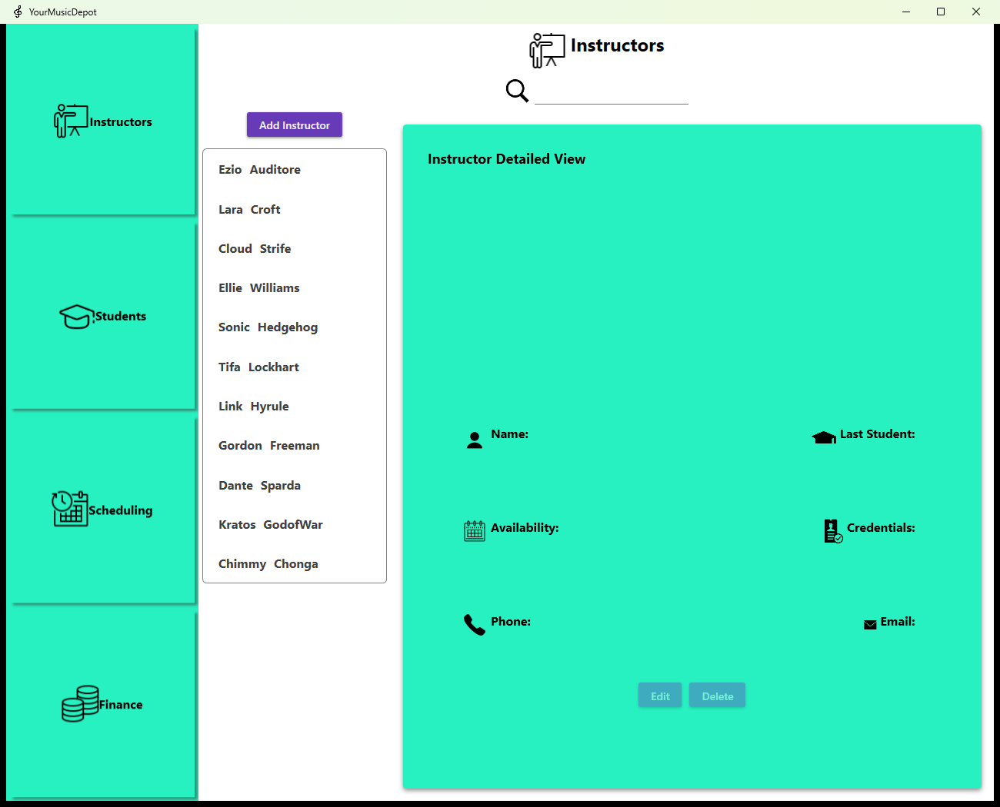
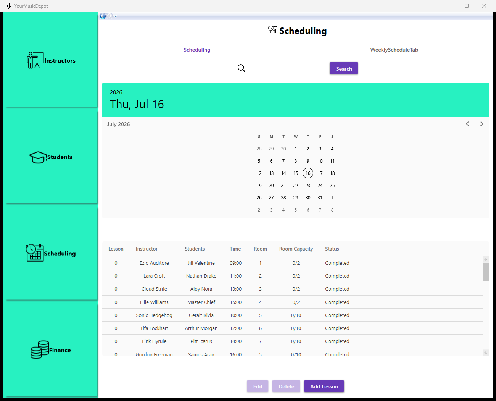
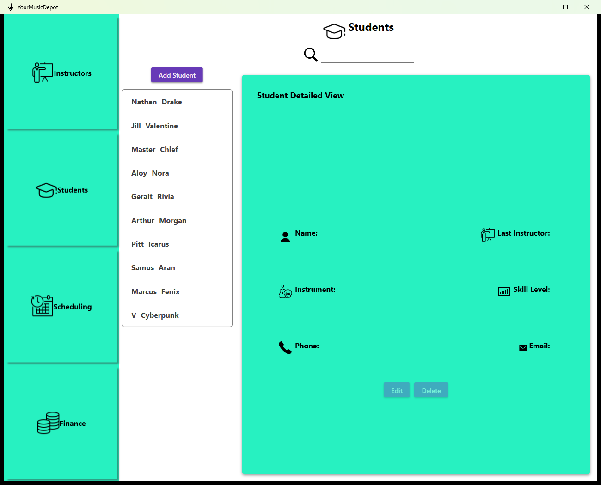
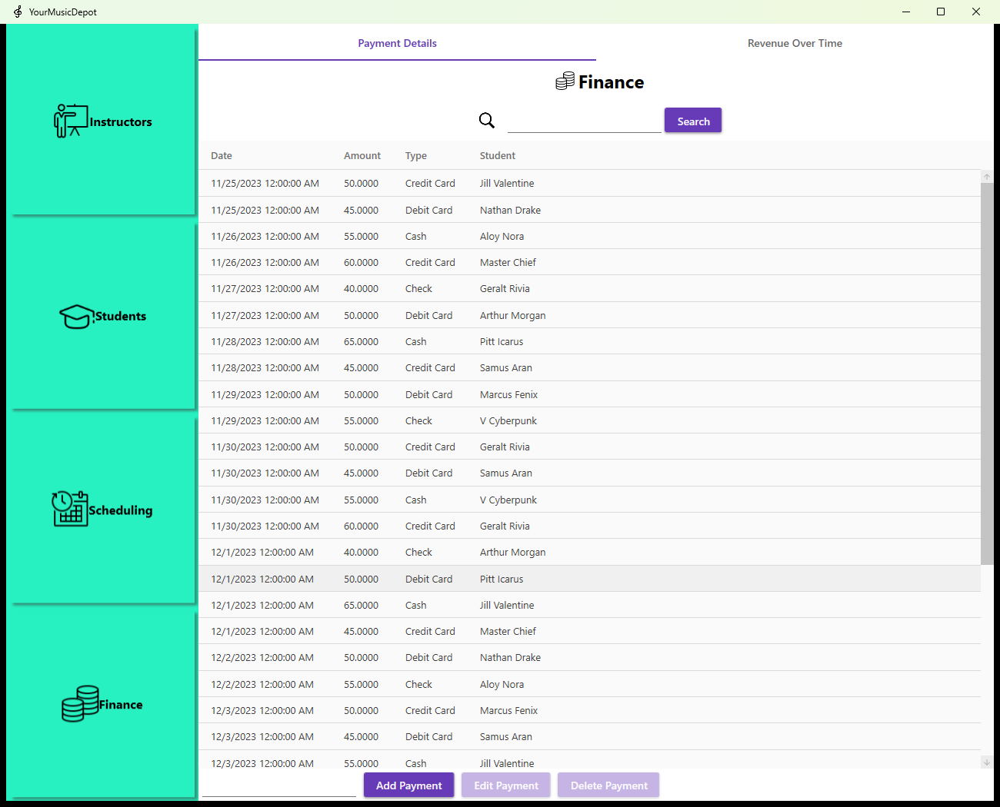

# YourMusicDepot

A Windows desktop application for managing a music lesson studio — instructors, students, lesson scheduling, and payments — built with WPF and Entity Framework Core.



## Features

- **Instructors** — manage instructor profiles, credentials, contact info, and weekly availability; see the last student each instructor taught
- **Students** — student roster with instrument, skill level, and progress tracking, plus full add/edit/delete and live search
- **Scheduling** — calendar-based lesson scheduling with room assignment and capacity tracking, powered by the Syncfusion WPF Scheduler, including a weekly schedule view
- **Finance** — payment history per student with search, plus a revenue-over-time chart built with LiveCharts

| Instructors | Scheduling |
| --- | --- |
|  |  |

| Students | Finance |
| --- | --- |
|  |  |

## Tech stack

- **.NET 7 / WPF** with the MVVM pattern (views, view models, and `RelayCommand` bindings)
- **Entity Framework Core 7** with SQL Server and the repository pattern (interface-per-repository, DI-friendly)
- **Material Design in XAML** for styling
- **Syncfusion WPF Scheduler** for the calendar UI
- **LiveCharts** for revenue visualization

## Project structure

```
YourMusicDepotApp/
├── Models/          # EF Core entities + RelayCommand
├── Data/            # YourMusicDepotContext (DbContext, fluent relationship config)
├── Repositories/    # Interfaces + implementations per aggregate
├── ViewModels/      # One view model per module
├── Views/           # XAML views and add/edit dialog windows
├── Converters/      # Value converters used in bindings
└── scripts/         # Database schema + demo seed data (at repo root)
```

## Getting started

### Prerequisites

- Windows 10/11
- [.NET 7 SDK](https://dotnet.microsoft.com/download/dotnet/7.0) (or later)
- SQL Server (any edition — [Express](https://www.microsoft.com/en-us/sql-server/sql-server-downloads) works fine)

### 1. Create the database

```powershell
sqlcmd -S localhost -E -Q "CREATE DATABASE YourMusicDepot_Database"
sqlcmd -S localhost -E -d YourMusicDepot_Database -i scripts/create-database.sql
sqlcmd -S localhost -E -d YourMusicDepot_Database -i scripts/seed-data.sql   # optional demo data
```

If your SQL Server instance isn't `localhost`, update the connection string in `YourMusicDepotApp/appsettings.json`.

### 2. Syncfusion license (optional)

The scheduler uses Syncfusion components, which are free under the [Syncfusion Community License](https://www.syncfusion.com/products/communitylicense). Without a key the app still runs but shows a trial dialog. To register a key, create `YourMusicDepotApp/appsettings.local.json` (git-ignored):

```json
{
  "Syncfusion": {
    "LicenseKey": "YOUR-KEY-HERE"
  }
}
```

or set the `Syncfusion__LicenseKey` environment variable.

### 3. Run

```powershell
dotnet run --project YourMusicDepotApp
```
